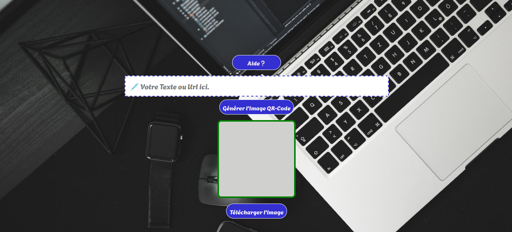
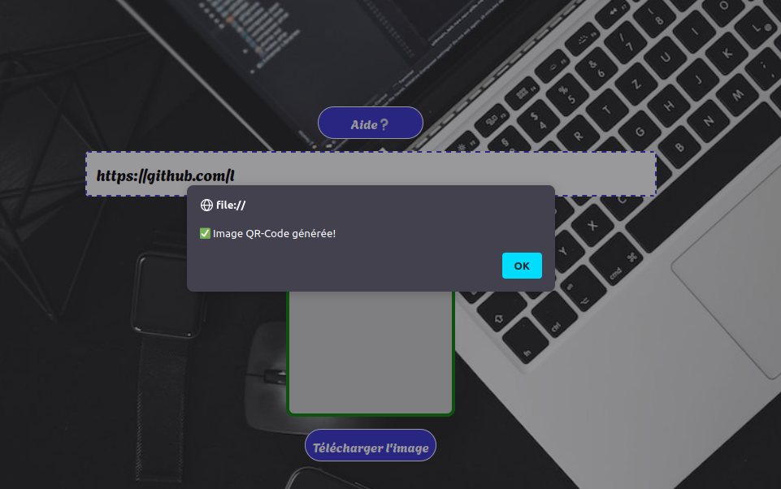
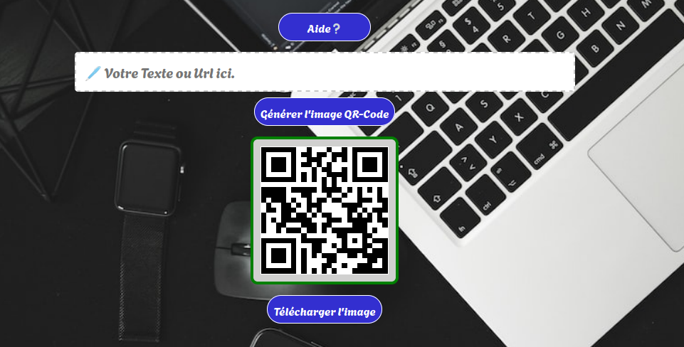

# Produire-votre-qrcode

Cet utilitaire tout simple vous permettra de générer une image QRCode au format png.

## Une génération d'image avec une adresse web
Il est aussi possible de générer du simple texte

## Image qrcode générée

